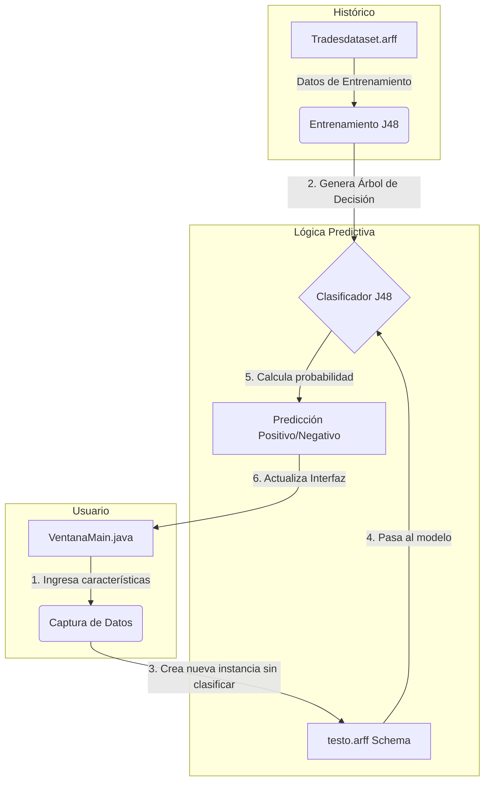

<div align="center">
  <h1>📈 Futures Trading Predictor</h1>
  <p><strong>Predicción de Operaciones de Trading utilizando Machine Learning (Weka)</strong></p>
</div>

<br>

Este proyecto es una aplicación de escritorio desarrollada en Java que utiliza minería de datos y Machine Learning para predecir si el resultado de una operación de trading de futuros será **Positivo** o **Negativo**. Fue concebido y desarrollado originalmente en el **verano del 2018** por *Adrian Luna*, como una demostración técnica de la integración de algoritmos predictivos (Weka) en el análisis del comportamiento de mercados financieros.

---

## ✨ Características Principales

- 🖥️ **Interfaz Gráfica de Usuario (GUI):** Construida con Swing, ofrece una forma intuitiva de introducir variables del comportamiento del mercado (tipo de trade, impulsos, rompimientos, etc.).
- 🧠 **Clasificador J48 (Árbol de Decisión):** Emplea la potente librería **Weka** para construir un árbol de decisiones basado en patrones históricos (`Tradesdataset.arff`).
- 🚀 **Compilación Automatizada (Maven):** Configurado con Apache Maven para la gestión transparente de dependencias y construcción del proyecto (`pom.xml`).
- ⚡ **Ejecución Simplificada (Windows):** Incluye un script `run.bat` inteligente que descarga Maven si es necesario y ejecuta el programa con un solo clic.

## 📂 Estructura del Proyecto

El repositorio sigue una arquitectura estándar orientada a Maven:

```text
FuturesTradingPredictor/
├── pom.xml                 # Archivo de configuración Maven y dependencias
├── run.bat                 # Script de inicio rápido para Windows
└── src/
    └── main/
        ├── java/conprob/   
        │   ├── NuevoData.java    # Estructura del Dataset (headers y atributos)
        │   ├── Prediccion.java   # Lógica del clasificador J48 y predicción
        │   └── VentanaMain.java  # Código de la ventana y eventos GUI
        └── resources/data/
            ├── Tradesdataset.arff # Histórico de trades para entrenar el modelo
            └── testo.arff         # Plantilla base para inyectar nuevas instancias
```

## 🛠️ Instrucciones de Uso

### 🔹 Opción 1: La manera más rápida (Usuarios de Windows)
Si estás en Windows y quieres probar la aplicación inmediatamente sin configurar nada:
1. Abre el Explorador de Archivos y navega a la carpeta del proyecto.
2. Haz **doble clic en `run.bat`**.
3. El script automáticamente descargará las herramientas necesarias, compilará el código y abrirá la ventana de la aplicación.

### 🔹 Opción 2: Para Desarrolladores (Usando Maven)
Si tienes **Java JDK 11+** y **Maven 3.6+** instalados, puedes ejecutarlo desde la terminal:

```bash
# 1. Empaquetar el proyecto (construye un JAR con todas las dependencias incluidas)
mvn clean package

# 2. Ejecutar la aplicación
java -jar target/futures-trading-predictor-1.0-SNAPSHOT.jar
```

## 📊 Cómo Funciona el Modelo (Arquitectura y Lógica)

El corazón de la aplicación se basa en un modelo de **Aprendizaje Supervisado**. A continuación, se detalla el flujo arquitectónico de cómo los datos se convierten en predicciones:



1. **Recolección Histórica (`Tradesdataset.arff`)**: El sistema utiliza un conjunto de datos recopilados previamente que contienen ejemplos de operaciones reales. Cada operación tiene 9 características descriptivas (como el tipo de trade, si hubo rompimientos, etc.) y una etiqueta final que indica si la operación resultó ser exitosa (`Positivo`) o fallida (`Negativo`).
2. **Construcción del Modelo**: Cuando se pulsa el botón, Weka toma este archivo y entrena el algoritmo **J48**. Este algoritmo construye un **Árbol de Decisión**, encontrando los patrones matemáticos que diferencian un trade positivo de uno negativo.
3. **Inyección de la Nueva Operación**: Las características que seleccionas en la interfaz gráfica se empaquetan en una "nueva instancia" (usando el esquema de `testo.arff`). A esta instancia se le deja la etiqueta final en blanco (`?`).
4. **Predicción y Clasificación**: La nueva instancia se hace pasar por las ramas del Árbol de Decisión previamente construido. El modelo clasifica la instancia y decide, basándose en la historia, si terminará siendo `Positivo` o `Negativo`.
5. **Evaluación**: A la par de la predicción, el programa realiza una evaluación del propio modelo para obtener métricas de fiabilidad y muestra estos datos en la consola de la ventana.

---
<div align="center">
  <i>Desarrollado por <b>Adrian Luna</b> (2018)</i>
</div>
